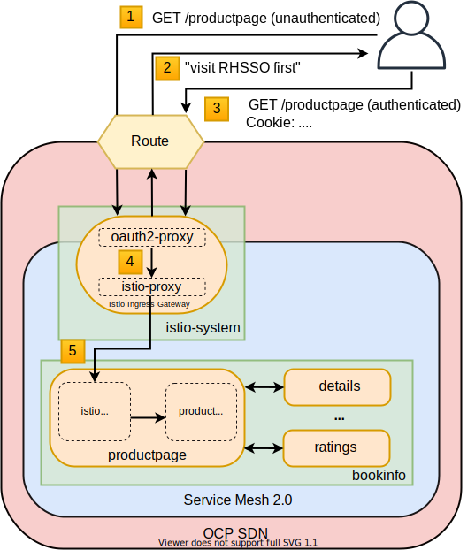

# servicemesh-2-rhsso-examples

This repository provides instructions and examples for restricting access to applications deployed in Service Mesh 2.0 to users authenticated/authorized with RHSSO.

This tutorial assumes a running OCP 4 cluster (>= 4.6) and cluster-admin user are available. 

For the sake of simplicity, it is better to delete and re-create the istio control plane and the bookinfo application when trying the different approaches below.

See README.md in subdirectories for more details.

## Prerequisites

* have Service Mesh 2.0 installed
* have a RHSSO platform inside the cluster deployed using the RHSSO operator
* have bookinfo service mesh application example deployed 

## Approach 1: Using Istio RequestAuthentication and AuthorizationPolicy Custom Resources

In this approach, access to the `bookinfo` application is restricted using Istio-related CRD [RequestAuthentication](https://istio.io/latest/docs/reference/config/security/request_authentication/) and [AuthorizationPolicy](https://istio.io/latest/docs/reference/config/security/authorization-policy/) deployed in the cluster. A user can access the application by providing a JWT token in its HTTP request (through the HTTP Header `Authorization`).

The workflow is as follows:

0. the user authenticates to RHSSO and get a JWT token (not shown in the above picture);
1. the user performs an HTTP request to `https://<route>/productpage` and passes along this request the JWT token;
2. the Istio ingress gateway (default one) forwards the request and the JWT token to the istio-proxy container of the productpage pod;
3. the istio-proxy container of the productpage pod checks the validity of the JWT token depending on the `RequestAuthentication` and `AuthorizationPolicy` objects deployed beforehand;
4. if the JWT token is valid, user accesses `/productpage` - otherwise, an error message is returned to the user (code 404, message "RBAC denied" or others).

### Pros:
* the simplest approach (only 2 CR to be deployed)
* fine-grained authorization based on JWT token fields

### Cons:
* no OIDC workflow: the user must get a JWT token on its own, and pass it with the HTTP request on its own
* need to define `RequestAuthentication` and `AuthorizationPolicy` objects for each application to protect inside the service mesh

## Approach 2: Injecting oauth2-proxy container inside the default Istio ingress gateway

In this approach, access to the `bookinfo` application is restricted by injecting an oauth2-proxy sidecar container to the Istio ingress gateway. The oauth2-proxy will enforce user authentication with RHSSO before forwarding any request to the istio-proxy (the default container of the Istio ingress gateway). In this approach, the OIDC workflow between the user, oauth2-proxy and RHSSO is perfomed automatically. 

The workflow is as follows:

1. the user performs an unauthenticated HTTP request to `https://<route>/productpage`;
2. the oauth2-proxy inside the Istio ingress gateway pod initiates the OIDC workflow to authenticate the user; user authenticates to RHSSO (not shown on the picture);
3. the user performs an authenticated HTTP request to `https://<route>/productpage`; the authentication is checked by the oauth2-proxy using HTTP cookies;
4. the oauth2-proxy forwards locally (same pod) the request to the istio-proxy container of the Istio ingress gateway, which in turn forwards the request to the istio-proxy container of the productpage pod;
5. user accesses `/productpage`.

### Pros:
* authentication enforced at the ingress gateway level (no need to define `RequestAuthentication` and `AuthorizationPolicy` objects for each application)
* automated OIDC workflow to authenticate the user

### Cons:
* coarse-grained authorization (authenticated == authorized)
* complex setup (involve patches)

## Approach 3: Best of both world

This approach combines the use of `RequestAuthentication` and `AuthorizationPolicy` objects as done for approach 1, and the injection of the oauth2-proxy container as done in the approach 2. In this approach, the oauth2-proxy container extracts the JWT token from the authentication cookie, and forwards it to the istio-proxy container alongside the HTTP request (using the `X-Forwarded-Access-Token` HTTP header). As a result, an automated OIDC workflow to authenticate the user is performed, and can be, if needed, combined to a fine-grained authorization based on JWT token fields (e.g. simple auth for 'non-secure' apps, auth + JWT field for more secure apps).

The workflow is as follows:

1. the user performs an unauthenticated HTTP request to `https://<route>/productpage``;
2. the oauth2-proxy inside the Istio ingress gateway pod initiates the OIDC workflow to authenticate the user; user authenticates to RHSSO (not shown on the picture);
3. the user performs an authenticated HTTP request to `https://<route>/productpage`; the authentication is checked by the oauth2-proxy using HTTP cookies;
4. the oauth2-proxy extracts the JWT token from the authentication cookie and forwards it locally (same pod) alongside the HTTP request to the istio-proxy container of the Istio ingress gateway;
5. the istio-proxy container of the Istio ingress gateway forwards the request and the JWT token to the istio-proxy container of the productpage pod;
6. the istio-proxy container of the productpage pod checks the validity of the JWT token depending on the `RequestAuthentication` and `AuthorizationPolicy` objects deployed beforehand;
7. if the JWT token is valid, user accesses `/productpage` - otherwise, an error message is returned to the user (code 404, message "RBAC denied" or others).

### Pros:
* authentication enforced at the ingress gateway level
* automated OIDC workflow to authenticate the user
* if needed, fine-grained authorization based on JWT token fields

### Cons:
* complex setup (currently involves deployment / service / route patches)

# References
* [Blog Openshift: Design Considerations at the Edge of the ServiceMesh](https://www.openshift.com/blog/design-considerations-at-the-edge-of-the-servicemesh)
* [Service mesh patterns repository](https://github.com/trevorbox/service-mesh-patterns/tree/master/ossm-2.0/auth)
* [Hints about how to debug istio](https://labs.consol.de/development/2020/05/07/debugging-istio.html)
* [oauth2-proxy repository](https://github.com/oauth2-proxy/oauth2-proxy)
* [oauth2-proxy integration with RHSSO](https://oauth2-proxy.github.io/oauth2-proxy/docs/configuration/oauth_provider/#keycloak-auth-provider)
* [Istio RequestAuthentication](https://istio.io/latest/docs/reference/config/security/request_authentication/) 
* [Istio AuthorizationPolicy](https://istio.io/latest/docs/reference/config/security/authorization-policy/) and [conditions](https://istio.io/latest/docs/reference/config/security/conditions/)
* [RHSSO operator documentation](https://access.redhat.com/documentation/en-us/red_hat_single_sign-on/7.4/html/server_installation_and_configuration_guide/operator)
